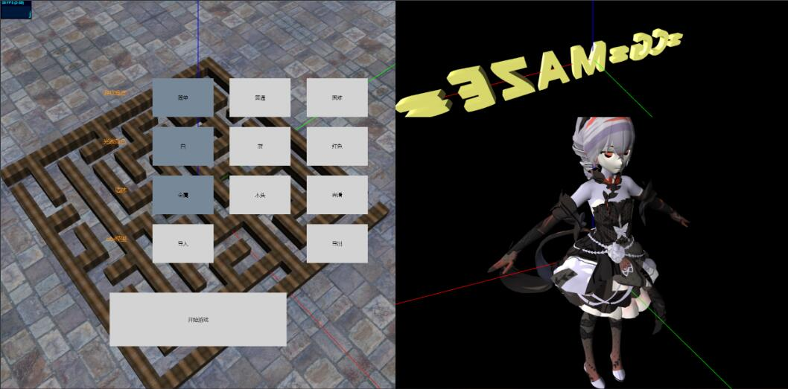
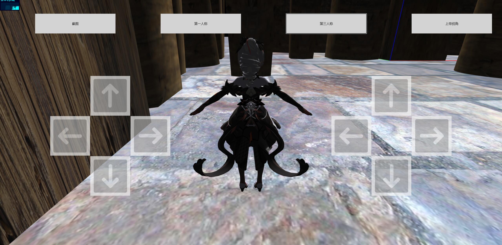
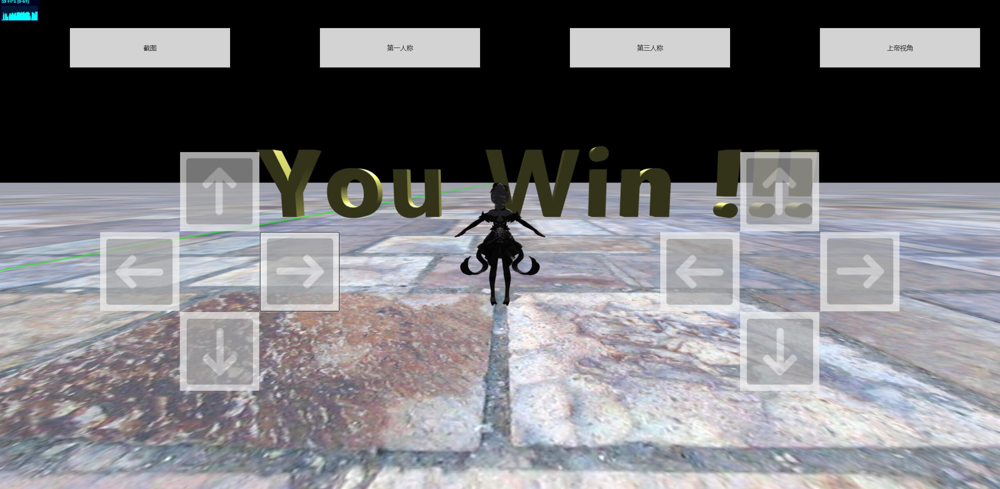

<h1 align = "center"> CG Project </h1>
<h4 align = "center">朱辰恺 3181013526</h4>
<h4 align = "center">王浩任 3180102759</h4>
<h4 align = "center">游添予 3180105613</h4>

## 项目简介
#### 技术背景与技术栈

##### HTML5

**HTML5**是HTML最新的修订版本，由万维网联盟（W3C）于2014年10月完成标准制定。目标是取代1999年所制定的HTML 4.01和XHTML 1.0标准，以期能在互联网应用迅速发展的时候，使网络标准达到符合当代的网络需求。广义论及HTML5时，实际指的是包括HTML、CSS和JavaScript在内的一套技术组合。

HTML5添加了许多新的语法特征，其中包括`<video>`、`<audio>`和`<canvas>`元素，同时集成了SVG内容。这些元素是为了更容易的在网页中添加和处理多媒体和图片内容而添加的。其它新的元素如`<section>`、`<article>`、`<header>`和`<nav>`则是为了丰富文档的数据内容。新的属性的添加也是为了同样的目的。同时也有一些属性和元素被移除掉了。一些元素，像`<a>`、`<cite>`和`<menu>`被修改，重新定义或标准化了。同时APIs和DOM已经成为HTML5中的基础部分了。HTML5还定义了处理非法文档的具体细节，使得所有浏览器和客户端程序能够一致地处理语法错误。

##### WebGL

**WebGL**是一种JavaScript API，用于在不使用插件的情况下在任何兼容的网页浏览器中呈现交互式2D和3D图形。WebGL完全集成到浏览器的所有网页标准中，可将影像处理和效果的GPU加速使用方式当做网页Canvas的一部分。WebGL元素可以加入其他HTML元素之中并与网页或网页背景的其他部分混合。WebGL程序由JavaScript编写的句柄和OpenGL Shading Language（GLSL）编写的着色器代码组成，该语言类似于C或C++，并在电脑的图形处理器（GPU）上运行。

##### Three.js

**Three.js**是一个跨浏览器的脚本，使用JavaScript函数库或API来在网页浏览器中创建和展示动画的三维计算机图形。Three.js使用WebGL。源代码托管在GitHub。Three.js允许使用JavaScript创建网页中的GPU加速的3D动画元素，而不是使用特定的浏览器插件。这归功于WebGL的出现。高级的JavaScript函数库例如Three.js或GLGE、SceneJS、PhiloGL或一定数量的其他函数库使作者在浏览器中显示复杂的三维计算机动画而不需要使用传统的独立应用程序或插件成为可能。

#### 游戏简介

人类建造迷宫已有5000年的历史。在世界的不同文化发展时期，这些奇特的建筑物始终吸引人们沿着弯弯曲曲、困难重重的小路吃力地行走，寻找真相。迷宫类小游戏应运而生。在游戏中，迷宫被表现为冒险舞台里，藏有各式各样奇妙与谜题或宝藏的危险区域。型态有洞窟、人工建筑物、怪物巢穴、密林或山路等。迷宫内有恶徒或凶猛的生物（真实存在或想像物体都有）徘徊，其中可能会有陷阱、不明设施、遗迹等。

游戏中的一个迷宫可抽象为为一个图论中的森林，且指定了起点和终点，并保证起点和终点在同一个连通块中，玩家从起点出发，控制人物走到终点则游戏胜利。

## 操作介绍
#### UI界面介绍
本项目的UI分为两部分，游戏加载页面为第一部分，游戏运行界面为第二部分。

**游戏加载页面**

在游戏加载页面中，主要分为场景、标题、人物预览和游戏设置按钮两个部分。

代码主体部分如下：

```html
<div id="start" class="full">
    <div id="menu">
        <div id="mazePre">
        </div>
        <div class="menuButtonDiv"> ......
        </div>
    <div id="preView">
        <div id="titlePre">
        </div>
        <div id="humanPre">
        </div>
    </div>
</div>
```

实际效果如下图所示，其中，点击左侧的按钮，可以实现修改游戏中环境设置的效果。具体的展示在需求处。



**游戏运行界面**

在游戏运行界面中，可以通过上方的按钮来切换视角或截图。也可以使用方向键来控制人物移动，或者视角旋转等。

代码主体部分如下：

```html
<div id="game" class="full" style="visibility:hidden;">
    <div id="consoleDiv" style="width: 20%;height: 10%;position: absolute; top: 5%;left: 5%;">
    </div>

    <div id="firstDiv" style="width: 20%;height: 10%;position: absolute; top: 5%;left: 30%;">
    </div>

    <div id="thirdDiv" style="width: 20%;height: 10%;position: absolute; top: 5%;left: 55%;">
    </div>

    <div id="godDiv" style="width: 20%;height: 10%;position: absolute; top: 5%;left: 80%;">
    </div>

    <div class="buttonDiv" style=" right: 10vw;">
    </div>
</div>
```


效果如下：



当人物走到终点时即可获得胜利，展示You Win，代表游戏胜利



## 需求实现展示

##### 1. 具有基本体素（立方体、球、圆柱、圆锥、多面棱柱、多面棱台）的建模表达能力。

如下：迷宫的障碍包括了长方体、球、圆柱、圆锥、多面棱柱、多面棱台等体素。


##### 2. 具有基本三维网格导入导出功能（建议OBJ格式）。

从obj文件中导入的标题模型和人物模型：


导出obj文件，通过浏览器下载到本地：


##### 3. 具有基本材质、纹理的显示和编辑能力。

在游戏加载界面选择墙体纹理，可调整迷宫墙体的纹理为木头、金属或光滑：

- 木头：

  

- 金属：

  

- 光滑：

  

##### 4. 具有基本几何变换功能（旋转、平移、缩放等）。

- 旋转及平移：玩家通过虚拟摇杆可控制人物模型移动及平移
- 缩放：游戏加载界面人物模型和标题模型缩放

##### 5. 基本光照明模型要求，并实现基本的光源编辑（如调整光源的位置，光强等参数）。

- 调整光源位置：游戏加载界面标题模型的光源位置循环移动：

  

  

- 调整光源颜色：在游戏加载界面选择光照颜色，可改变游戏场景中的光照颜色，如改成蓝色：

  

##### 6. 能对建模后场景进行漫游如Zoom In/Out， Pan, Orbit, Zoom To Fit等观察功能。

在游戏界面提供了三种视角可选：第一人称、第三人称以及上帝视角：

- 在第三人称视角控制右侧摇杆可进行Zoom In/Out，如下:

  

  

- 在第一或第三人称视角，操作左侧摇杆控制角色移动时，视角自动pan，如下：

  

  

- 在第一或第三人称视角下，操作右侧摇杆可进行orbit，如下：

  

  

##### 7. 能够提供屏幕截取/保存功能。

在游戏中可以导出截图并下载到本地：


##### 8. 漫游时可实时碰撞检测。

在游戏过程中，角色碰到障碍物边界会停止移动，使用`bounding box`实现，验收时已展示，不再赘述

##### 9. 采用HTML5/IOS/Android移动平台实现。

本项目使用HTML5实现，可在任意现代浏览器上运行：

- PC端演示：

  

- 移动端演示：

  加载界面：

  

  游戏界面：

  

  截图功能：

  

  

  游戏正常操作及胜利判断：

  

  

  验收时已展示，不再赘述。

##### 11. 构建了基于此引擎的完整三维游戏，具有可玩性。

如上的展示，我们实现了符合移动端操作逻辑的迷宫游戏，具有三种不同难度，在移动端具有较强的可玩性。


## 测试方法

1. 从[此处](https://github.com/mrdoob/three.js/archive/master.zip)下载`three.js`源码，并将源代码置于项目目录下的`/three.js-master/three.js-master`下。
2. 在项目目录运行http服务器（为了解决跨域访问的问题），通过本机浏览器或同一个子网下的其他设备访问对应端口即可。
3. 如果测试不便，烦请助教/老师联系我们，我们可以把项目上传到服务器运行，供助教/老师进行测试。


## 项目分工

- 朱辰恺：设计制作游戏界面框架，搜集/制作场景中需要的obj模型，实现截图功能。
- 王浩任：设计游戏逻辑；使用WebGL绘制场景和3d对象；相机控制；光照控制；场景漫游。
- 游添予：实现obj导入/导出功能，实现材质调整和光照颜色调整功能，撰写实验文档。

